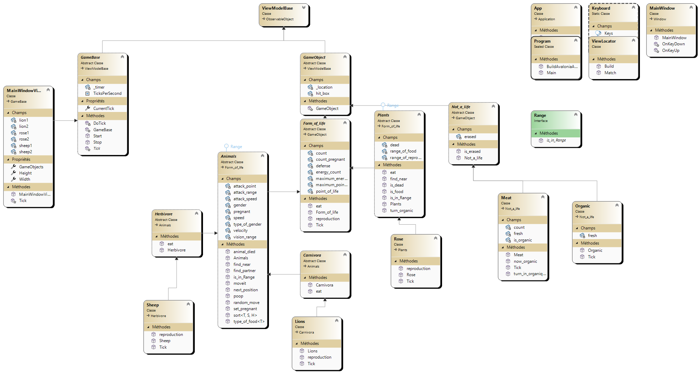

# Rapport du projet Ecosysteme :

## Les principes SOLID :

On va d'abords commencé par vous présentez les deux principes SOLID qu'on a utilisé dans ce code. On utilise le Open/Closed principle et le Dependency Inversion Principle.

### Open/Closed principle :

On a coder pour que maintenant avec le code en etat si on veut ajouter des nouveaux animaux on devrait rien changé au codes actual simplement crée une nouvelle classe et l'ajouter dans notre mainWindow. Si nous voulons ajouter des nouveaux types d'animaux ou meme des etres humains ce serait possible. Le seul momment ou le code de base devrait etre changer c'est pour modifier des fonctionalité déja existante par exemple si on veut implementer la notions de vitesse d'attaque on devrait aller regarder dans la méthode eat comment l'implementer.

### Dependency Inversion Principle :

Toutes les classes qu'on a crée ne dépendent que de classe abstaraite ou d'interface.

## Diagramme de classe :

